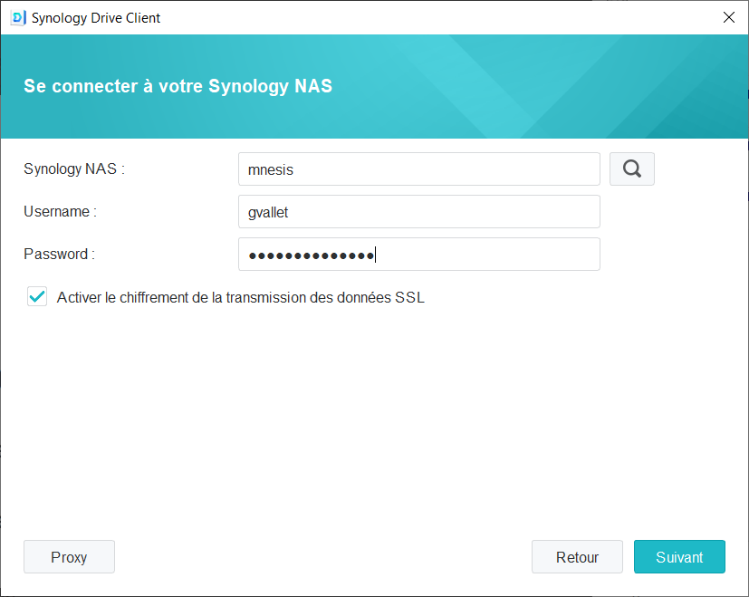
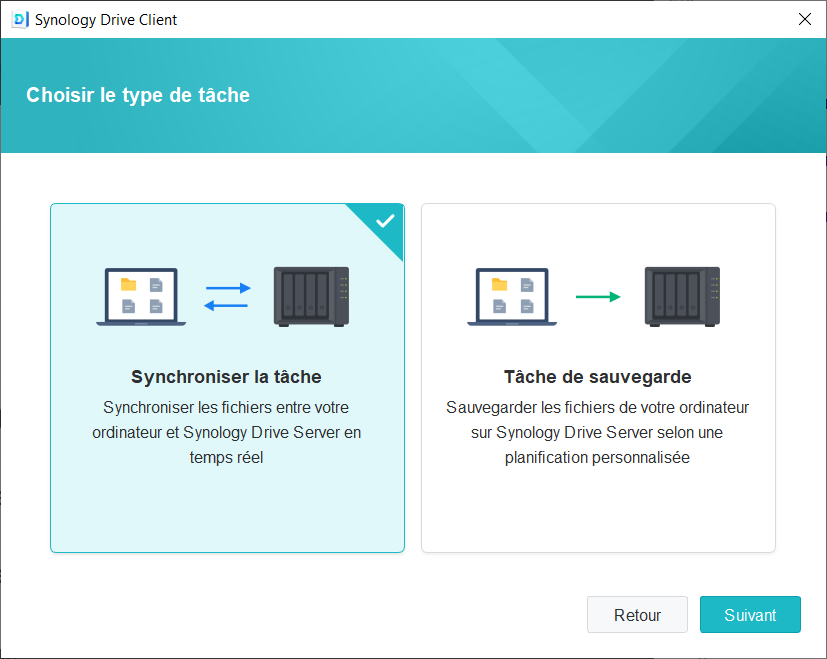
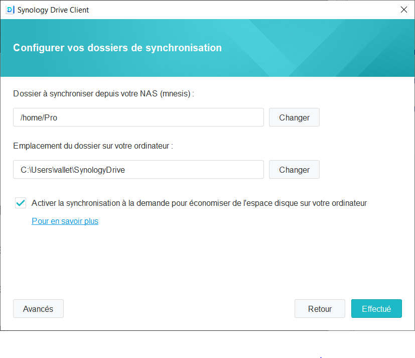

# Serveur du laboratoire

## Présentation générale
Le laboratoire est équipé d'un serveur (NAS - Network Attached Storage) qfin de centraliser les documents de travail de l'ensemble de ses membres. 
Ce serveur permet également de sécuriser ces données grâce à un système de sauvegarde automatisée hors site (infonuagique).
La solution utilisée, *Synology Drive*, offre une sorte d'équivalent à Dropbox, Google Drive, etc. 
Vous aurez à disposition un logiciel qui synchronisera automatiquement vos documents avec le serveur de manière transparente pour vous.

> Vous **devrez** donc utiliser les outils présentés dans cette section afin de vous assurer la sécurité des données.

Ce logiciel permet également de synchroniser vos documents sur plusieurs machines ou de les rendre accessible en mobilité (tablette, téléphone intelligent...).

## Synology Drive 

### Téléchargement et installation du client
Vous pouvez télécharger le client Synology Drive à cette adresse : https://www.synology.com/en-ca/support/download/DS920+?version=7.1#utilities
Cliquez ensuite sur le bouton "Download" au niveau de la ligne "Synology Drive Client". 
Choisissez la version qui correspond à votre système d'exploitation ("Windows (msi)" ou "Mac (dmg)") et cliquez sur le bouton "Download" associé.

Une fois le fichier d'installation téléchargé, double-cliquer dessus et suivez les consignes à l'écran.

### Configuration initiale du client

!> Si vous n'avez pas encore de compte créé sur le serveur, merci de contacter Guillaume Vallet : guillaume.vallet@uqtr.ca

1. **Synology NAS** : écrire "mnesis"
2. **Username** : votre nom d'utilisateur sur le serveur
3. **Password** : votre mot de passe d'utilisateur sur le serveur
4. Cocher la case "Activer le chiffrement de la transmission des données SSL" 

### Configuration du mode de synchronisation

Cliquez sur "suivant" puis choisissez "Synchroniser la tâche"

### Configuration du dossier à synchroniser

Cliquez sur "suivant" puis choisissez votre dossier de travail (par exemple "UQTR", "These", "Recherche", etc.)
Ce dossier peut être un dossier que vous avez déjà créé ou un dossier que vous allez créé pour contenir tous vos fichiers de travail lié au laboratoire.
Vous pouvez utiliser ce serveur pour synchroniser/sauvegarder vos autres données "professionnels" (en lien avec l'UQTR), mais merci de garder à l'esprit que ces données peuvent être visible et accessible par l'admistrateur du serveur (Guillaume Vallet).

!> **Attention**, toutes les données synchronisées/sauvegardées sur le serveur sont visibles et accessibles aux administeurs du serveur 

!> **Attention**, il est de votre responsabilité de ne synchroniser que des données vous appartenant ou appartenant au laboratoire. Tout transfert de fichiers enfreignant la loi est formellement interdis !

